<div align="center">


<br/>

<a href="https://linkedin.com/in/shani-vaishnav"></a>
<a href="https://github.com/sunnyvaishnav7"></a>
<a href="https://twitter.com/sunnyvaishnav77"></a>
<a href="mailto:[FILL IN YOUR EMAIL]"></a>


</div>

<br/>


## `01` ABOUT

<table>
<tr>
<td width="65%" valign="top">

I'm a **Cybersecurity Analyst** focused on **SOC operations, threat detection, and vulnerability assessment (VAPT)**. I build home-lab environments to practice detecting, investigating, and reporting real attack patterns — from brute-force logins in Splunk to OWASP Top 10 flaws in vulnerable web apps.

**`[FILL IN]`** — 1–2 lines that make you stand out: a CTF rank/platform score, a bug bounty submission, hours logged on TryHackMe/HTB, or your home-lab scale (VM count, tools stitched together).

> 🎯 **Currently targeting:** SOC Analyst (L1/L2) · VAPT Analyst

</td>
<td width="35%" valign="top" align="center">

```yaml
role:      Cybersecurity Analyst
focus:     SOC · VAPT
mindset:   detect → investigate → respond
location:  "[FILL IN]"
status:    open to opportunities
```

</td>
</tr>
</table>

<br/>

## `02` SKILLS

<table width="100%">
<tr><td width="50%" valign="top">

**🔵 SIEM & Monitoring**


`SPL` `KQL` `Alert Triage` `Log Correlation` `IOC Investigation`

**🌐 Network Security**


`TCP/IP` `DNS` `HTTP/HTTPS` `Packet Analysis` `Recon & Enumeration`

</td><td width="50%" valign="top">

**🔴 VAPT & Web App Security**


`AuthN/AuthZ Testing` `Input Validation` `Session Security`

**🐧 Linux & Scripting**


`CLI` `Log Analysis` `Process Mgmt`

</td></tr>
</table>

**📚 Frameworks & Standards**
`MITRE ATT&CK` · `OWASP Top 10` · `CIA Triad` · `ISO 27001 Fundamentals` · `Incident Response Lifecycle`

<br/>

## `03` SOC WORKFLOW

```mermaid
flowchart LR
    A[🚨 Alert] --> B[🔍 Triage]
    B --> C[📊 Log Analysis]
    C --> D[🎯 IOC ID]
    D --> E[🕵️ Investigation]
    E --> F[⚖️ Severity]
    F --> G[🛑 Contain / Escalate]
    G --> H[📝 Document]

    style A fill:#0D1117,stroke:#00D9FF,color:#fff
    style B fill:#0D1117,stroke:#00D9FF,color:#fff
    style C fill:#0D1117,stroke:#00D9FF,color:#fff
    style D fill:#0D1117,stroke:#00D9FF,color:#fff
    style E fill:#0D1117,stroke:#00D9FF,color:#fff
    style F fill:#0D1117,stroke:#00D9FF,color:#fff
    style G fill:#0D1117,stroke:#00D9FF,color:#fff
    style H fill:#0D1117,stroke:#00D9FF,color:#fff
```

<div align="center">



*(GitHub renders Mermaid diagrams natively — this will show as a real flowchart on your profile page.)*

</div>

<br/>

## `04` PROJECTS

> Evidence-first. Each card should link to a real repo with a README, screenshots, and the queries/steps used.

<table width="100%">
<tr>
<td width="33%" valign="top">

### 🛰️ SIEM Threat Detection Lab
`Splunk` `SPL` `Linux`

Built a **[FILL IN — e.g. "3-VM lab: Splunk server, Windows target, Kali attacker"]** and wrote **[FILL IN — e.g. "8 SPL queries"]** to detect brute-force and privilege-escalation events.

**Result:** `[FILL IN — a real number or outcome]`

**[→ View Repo](FILL_IN_LINK)**

</td>
<td width="33%" valign="top">

### 📡 Network Security Lab
`Wireshark` `Nmap` `TCP/IP`

Performed recon and service enumeration against **[FILL IN target]**, then captured/analyzed traffic to identify **[FILL IN finding]**.

**Result:** `[FILL IN — a real number or outcome]`

**[→ View Repo](FILL_IN_LINK)**

</td>
<td width="33%" valign="top">

### 🕸️ Web App Security Lab
`Burp Suite` `OWASP Top 10`

Tested **[FILL IN target app]** for OWASP Top 10 issues. Found and validated **[FILL IN vuln types]** with reproduction steps.

**Result:** `[FILL IN — a real number or outcome]`

**[→ View Repo](FILL_IN_LINK)**

</td>
</tr>
</table>

<br/>

## `05` CERTIFICATIONS & LEARNING PATH

<table width="100%">
<tr><td width="50%" valign="top">

**🎓 Certifications**
- `[FILL IN — real cert, issuer, date]`
- *(Delete this block if none yet — keep everything under Learning Path instead.)*

</td><td width="50%" valign="top">

**🌱 Currently Learning**
- Threat Hunting
- Advanced SIEM Detection Engineering
- Incident Response
- Cloud Security Fundamentals
- Working toward: `[FILL IN — e.g. Security+, eJPT, BTL1]`

</td></tr>
</table>

<br/>

## `06` GITHUB ANALYTICS

<div align="center">


</div>

<br/>


## `07` CONTACT

<div align="center">

**Email:** `[FILL IN]` &nbsp;·&nbsp; **Resume:** `[FILL IN link]`

<a href="https://linkedin.com/in/shani-vaishnav"></a>
<a href="https://github.com/sunnyvaishnav7"></a>

<br/><br/>

<i>"Security is not about preventing every attack — it's about detecting, responding, and continuously improving."</i>

</div>

